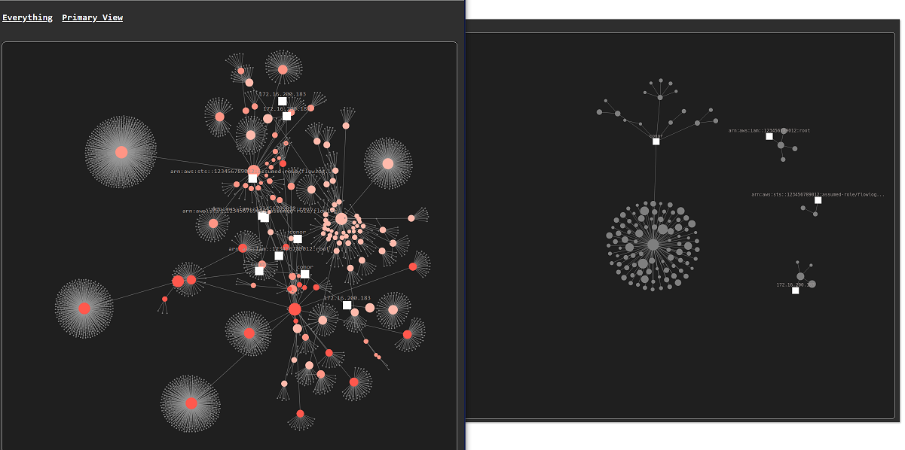

### Data Layer For the Protostar Project

For pre-processing alerts and detection artifacts, and their entities, for ingestion into the PROTOSTAR knowledge graph. Prerequisites: an instance of neo4j (https://neo4j.com/product/neo4j-graph-database/) You can use the Python module in the recognizer folder to process your raw alerts or you can ingest the sample alerts in the data folder which are pre-processed. 

Setup of the data layer is covered in [SETUP.md](SETUP.md).

Once installed, this is a sort of select all in the neo4j data layer:

```
match(n:ENTITY)
where n.view = 2
return n
```
### Running the Tests

All tests live in the tests folder. There are two kinds: fast unit tests that anyone can run with no setup, and one integration test that needs a Neo4j instance.

```
go test ./...
```

Run from the repository root, that command runs everything (add `-count=1` to skip Go's test cache; `cd tests` and plain `go test` also works and never caches); the integration test skips itself unless you opt in (see below), so this is always safe.

#### Unit tests (tests/config_test.go, tests/data_test.go)

- **TestEnvOr** checks the configuration fallback logic: an environment variable is used when set, otherwise the built-in default applies.
- **TestAlertKeyUniqueness** validates the sample data in the data folder against the invariant the importer depends on: a guid may appear on more than one alert (several detections can fire on the same source document), but the combination of guid and detection name must be unique. The importer deduplicates ALERT nodes on that pair, so if two *different* events ever shared a guid and name, the second would be silently dropped during import. This test makes that a loud failure instead: it reads every event exactly the way the importer does (including name normalization) and reports the offending file and position. Byte-identical repeated events are allowed, since merging them loses nothing. If you add new data files, this test is the first thing to run.

#### Integration test (tests/integration_test.go)

**TestImportIsIdempotent** exercises the importer end-to-end: it runs the actual CLI (`go run .`) twice against a real Neo4j database, importing every file in the data folder each time, and verifies the second pass changes nothing: the alert count, total node count, and total relationship count must be identical after both passes. This proves re-running the importer (which no longer wipes the graph by default) cannot duplicate data.

Safety properties:

- It is **skipped unless `NEO4J_TEST_URI` is set** — an explicit opt-in, so `go test ./...` can never touch a database by accident.
- It **refuses to run if the target database is not empty**, so it can never destroy existing data. Empty the database first (for example `MATCH (n) DETACH DELETE n` in the Neo4j browser, or run the importer with `-reset` and an empty data directory).
- It **deletes everything it imported before finishing**, leaving the database empty again. It only ever deletes data it created.

To run it, add `NEO4J_TEST_URI` to your `.env` file (see `.env.example`), pointing at an empty database:

```
NEO4J_TEST_URI=bolt://localhost:7687
```

then:

```
go test ./tests -run Idempotent -v -count=1
```

Connection credentials come from the same git-ignored `.env` file (or environment variables) the importer uses, so nothing needs to be passed on the command line.

Every test prints what it is verifying and its status as it runs, and a summary table is printed at the end; `-v` adds detailed step-by-step narration. Note on caching: when invoked with a package argument (`go test ./...` or `go test ./tests`), Go may serve cached results and will not notice changes to your `.env` file or database. Add `-count=1` to force a real run; plain `go test` inside the tests folder never caches.

### Visualization and Web Front End:

After the data layer is running, download and run the web server which provides a user interface: https://github.com/opendr-io/protostar-web


