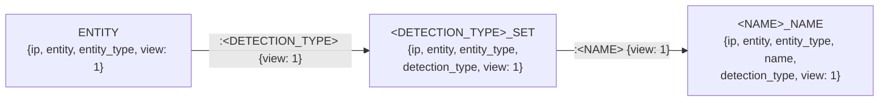
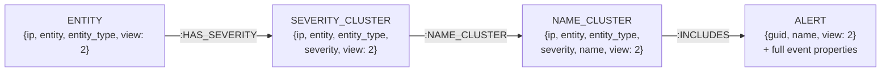

# The Neo4j Graph Model

This documents the graph schema that the importer creates, and the exact semantics of the code in [`views/`](../views) — the part of this project that is least obvious from reading the code, and the part a future port (e.g. to Python) must reproduce exactly.

## What a "view" is

A *view* here is **not** a Neo4j database view (Neo4j has no such thing). It is a convention of this project: the importer builds **two independent subgraphs from the same events**, and every node carries a `view` property (`1` or `2`) identifying which subgraph it belongs to. The `view` property is part of every `MERGE` key, so the two subgraphs never share nodes — an entity that appears in both views exists as two separate `ENTITY` nodes, one with `view: 1` and one with `view: 2`.

- **View 1** groups each entity's alerts by *detection type*, then by *detection name*, using **dynamically constructed labels and relationship types** (see below).
- **View 2** groups each entity's alerts by *severity*, then by *detection name*, and is the only view that stores the full `ALERT` nodes. The web front end ([protostar-web](https://github.com/opendr-io/protostar-web)) queries view 2.

Consumers filter with `WHERE n.view = 1` or `n.view = 2`.

## From JSON event to query parameters

[`main.go`](../main.go) parses each `.json` file in the data directory (an array of event objects) with `gjson` and builds one parameter map per event. Every query in both views runs with this same map. Semantics that matter:

- **Every value becomes a string.** `gjson`'s `.String()` stringifies non-string JSON values (`dest_port: 443` → `"443"`) and returns `""` for missing keys. All graph properties are therefore strings, and absent fields are empty strings, not nulls.
- **Two fields are normalized**, and only these two:

  ```go
  reg := regexp.MustCompile(`[^a-zA-Z0-9]+`)
  detection_type = strings.ToUpper(reg.ReplaceAllString(raw, "_"))
  name           = strings.ToUpper(reg.ReplaceAllString(raw, "_"))
  ```

  Every run of non-alphanumeric characters collapses to a single `_`, then the result is uppercased. Example: `"Endpoint Machine Learning"` → `"ENDPOINT_MACHINE_LEARNING"`. Leading/trailing junk becomes a leading/trailing underscore (`" x "` → `"_X_"`), it is not trimmed.
- **Fields extracted** (in the order of `main.go`): `source`, `guid`, `timestamp`, `detection_type`*, `name`*, `severity`, `category`, `mitre_tactic`, `entity`, `entity_type`, `host_ip`, `source_ip`, `dest_ip`, `dest_port`, `dst_geo`, `username`, `syscall_name`, `executable`, `process`, `message`, `proctitle`. (* = normalized as above.)
- `source` is extracted but **never used** by either view. Fields present in some data files but not in this list (e.g. `user_agent`) are silently dropped.

## View 1 — detection-type hierarchy ([`views/view1.go`](../views/view1.go))

One query per event builds a three-level chain:



The critical quirk: **node labels and relationship types are data-dependent.** The query text is assembled with `fmt.Sprintf`, splicing in the *normalized* `detection_type` and `name` values:

| Placeholder | Becomes | Example |
|---|---|---|
| middle node label | `<detection_type>_SET` | `ENDPOINT_ALERT_SET` |
| first relationship type | `<detection_type>` | `ENDPOINT_ALERT` |
| leaf node label | `<name>_NAME` | `HEURISTIC_BEACONING_DETECTION_NAME` |
| second relationship type | `<name>` | `HEURISTIC_BEACONING_DETECTION` |

This works — and is safe against Cypher injection — **only because** the normalization above guarantees these values match `[A-Z0-9_]*`. Everything else in the query is a proper `$parameter`. Two edge cases the current code does not guard against: a `detection_type`/`name` that normalizes to the empty string produces an invalid relationship type (`[:{view: 1}]`), and one that starts with a digit produces an identifier Cypher rejects without backticks. The sample data never hits either; arbitrary data could.

All three nodes use `MERGE` with `ON CREATE SET x.count = 1 / ON MATCH SET x.count = x.count + 1`, so `count` is the number of times that combination has been *processed* — including across repeated imports of the same file (see [Idempotency](#idempotency-and-counts)).

## View 2 — severity hierarchy and alerts ([`views/view2.go`](../views/view2.go))

Two queries per event (the `ENTITY` merge is a separate statement; the rest is one statement that starts by `MATCH`ing it):



Fixed labels and relationship types this time (note the relationship `:NAME_CLUSTER` shares its name with the node label it points to — that's historical, not meaningful). Unlike view 1, the relationships carry no `view` property; only the nodes do.

The three cluster nodes maintain `count` exactly like view 1. The `ALERT` node is different:

- **Merge key is `(guid, name)`** (plus the constant `view: 2`). A guid may appear on several alerts — multiple detections can fire on the same source document — but guid + normalized name is unique per event. `tests/data_test.go` enforces this invariant on the sample data.
- **All event properties are set `ON CREATE` only**: `timestamp`, `detection_type`, `category`, `mitre_tactic`, `entity`, `entity_type`, `host_ip`, `source_ip`, `dest_ip`, `dest_port`, `dst_geo`, `username`, `syscall_name`, `executable`, `process`, `message`, `proctitle`, `severity`. Re-importing an event whose properties changed (same guid and name) updates **nothing** — the original alert wins. `ALERT` nodes have no `count`.

## Idempotency and counts

Re-running the importer over the same data creates no new nodes or relationships — every write is a `MERGE`, and `tests/integration_test.go` verifies node/relationship/alert counts are identical after a second pass. But the `count` **property** on `ENTITY`, `*_SET`, `*_NAME`, `SEVERITY_CLUSTER`, and `NAME_CLUSTER` nodes *does* keep incrementing: it counts processing events, not distinct alerts. After importing the same file twice, every `count` has doubled. Treat `count` as meaningful only relative to a single import into a clean graph (which is what `-reset` gives you).

## Execution and error handling

- Each event is written by **three separate auto-commit queries** (one for view 1, two for view 2) — there is no transaction around an event or a file. A crash mid-event can leave a partial hierarchy; because everything is a `MERGE`, re-running the importer heals it.
- [`utils.HandleResult`](../utils/error.go) treats a failure to *submit* a query as fatal (`log.Fatal`), but a server-side query error is only **logged** (prefixed `>>>`) and the import continues with the next event. Bad events are skipped noisily, not loudly.
- `-reset` calls [`utils.DeleteAll`](../utils/delete.go), which deletes *all* nodes in the database (not just this project's) in batches of 10,000 until none remain.
- No indexes or uniqueness constraints are created. `MERGE` performance degrades on large graphs without them; a port may want to add constraints matching the merge keys above.

## Notes for a Python port

Behaviors a port must preserve exactly, or existing graphs and re-imports will diverge:

1. **The normalization function** for `detection_type` and `name`: collapse `[^a-zA-Z0-9]+` runs to a single `_`, uppercase, no trimming. In Python: `re.sub(r'[^a-zA-Z0-9]+', '_', raw).upper()`.
2. **String coercion everywhere.** Python's `json` module yields real ints/bools where gjson yielded strings. Coerce every extracted field with `str()` (and map missing keys to `""`, not `None`) or merge keys will stop matching nodes written by the Go importer (`443 ≠ "443"` in a Neo4j property comparison).
3. **Dynamic labels in view 1.** The official Python driver also cannot parameterize labels/relationship types; the port must do the same string formatting, and its safety still rests entirely on the normalization in (1) being applied first.
4. **Merge keys**, verbatim: the property sets shown in the diagrams above, including the `view` constant, and `ALERT` on `(guid, name, view)` with `ON CREATE`-only properties.
5. **Per-event query order** (view 1, then view 2's entity merge, then view 2's hierarchy) only matters if you preserve the non-transactional style; wrapping each event in one transaction would be a strict improvement.
6. The error-handling asymmetry in (see above) — fatal on submission failure, log-and-continue on query error — is probably worth *not* preserving, but know that today a data-quality problem does not stop an import.

## What this doc does not cover

Gaps in the current model and candidate future views (timestamp normalization, process identity, a network-connections view) are collected in [FUTURE_WORK.md](FUTURE_WORK.md); this document describes only what the importer builds today.
